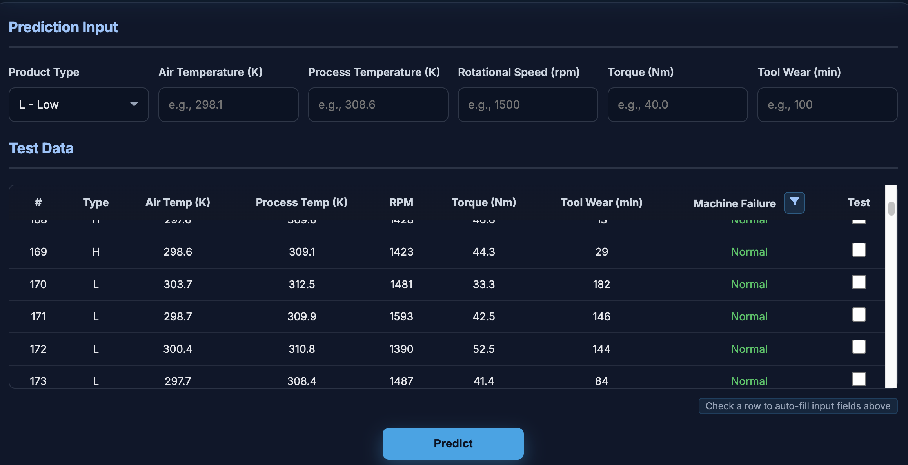
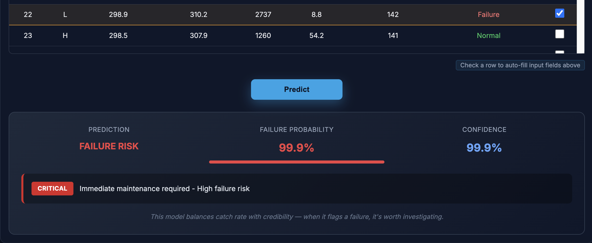
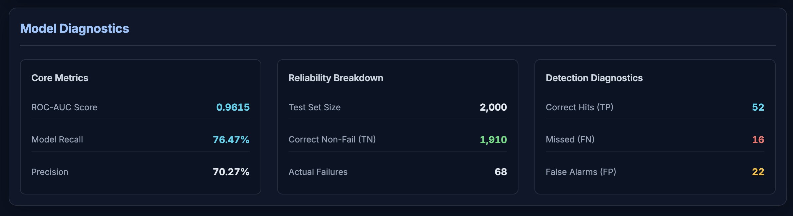
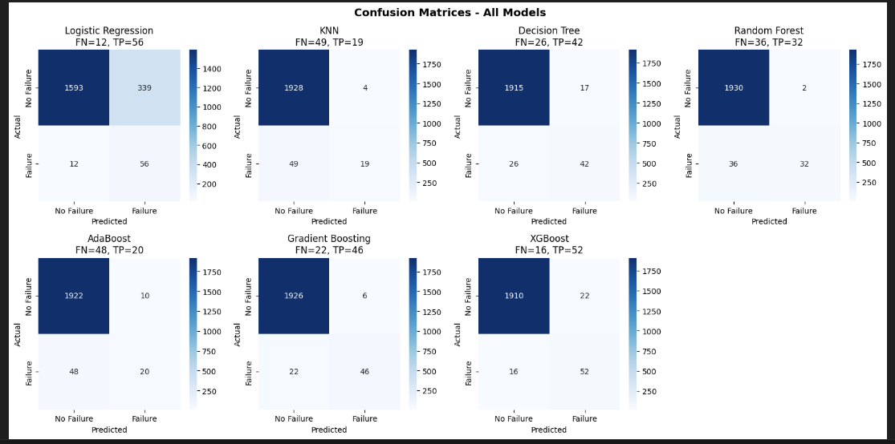

# Machine Failure Prediction

FastAPI web app that predicts machine failures from sensor data. Uses an XGBoost model trained on the [AI4I 2020 Predictive Maintenance Dataset](https://archive.ics.uci.edu/dataset/601/ai4i+2020+predictive+maintenance+dataset) (10,000 records).

## Live Demo

You can try the app online:

[Machine Failure Prediction Dashboard (Live on Render)](https://ml-for-machine-maintenance.onrender.com)

- The landing page provides an overview and links to the dashboard.
- The dashboard lets you enter sensor readings, view model diagnostics, and test predictions interactively.
- The API endpoint is available at `/api/predict` for programmatic access.

---


## Domain Context

I am a Senior Technician at Samsung, where I work directly with production equipment and deal with unplanned downtime that impacts yield and operational cost. In semiconductor and electronics manufacturing, maintenance decisions depend on sensor telemetry  — the same parameters this model consumes.

The action-level system (Normal → Monitor → Warning → Critical) mirrors the triage process I follow on the production floor: not every anomaly warrants a line stop, but missed failures are costly. The model's threshold and metric choices were shaped by that firsthand operational experience.

## What it does

You enter sensor readings (temperature, RPM, torque, tool wear) and the model tells you if the machine is likely to fail. The dashboard also shows the failure probability and suggests an action level (normal / monitor / warning / critical).

There's a JSON API at `POST /api/predict` too.

> Tip: In the dashboard table, you can check a row's checkbox to auto-fill the prediction input fields above with that row's sensor values (Type, temperatures, RPM, torque, tool wear). This speeds up testing different scenarios.

#### Prediction Input
<!-- Screenshot: the sensor input form -->


#### Prediction Result
<!-- Screenshot: the result panel showing prediction, probability, confidence, and action -->


#### Model Diagnostics
<!-- Screenshot: the diagnostics card with core metrics, reliability breakdown, and detection diagnostics -->


## Model details

The dataset is heavily imbalanced (~3.4% failure rate). I compared 7 classifiers — Logistic Regression, KNN, Decision Tree, Random Forest, AdaBoost, Gradient Boosting, and XGBoost. Picked XGBoost because it had the best balance between recall and precision.

<!-- Screenshot: confusion matrices for all 7 algorithms side-by-side -->


Why that balance matters: from direct experience on the production floor, a model with high recall but poor precision generates excessive false alarms. Maintenance teams learn to distrust the system and begin ignoring alerts — which is when real failures get missed. For a predictive maintenance tool to be adopted in practice, it needs to catch failures (recall) while remaining credible when it flags something (precision), so technicians actually act on its recommendations.

Key decisions:
- Used `scale_pos_weight` to handle class imbalance instead of oversampling
- Tuned with `RandomizedSearchCV` (30 iterations, 5-fold stratified CV, scored on F1)
- Scored on F1 specifically because it penalizes models that sacrifice precision for recall or vice versa
- Only scaled numerical features (temperatures, rpm, torque, tool wear), left one-hot encoded `Type` columns as-is

Test set results (20% holdout, stratified):
- ROC-AUC: 0.96
- Recall: ~76%
- 52 true positives, 22 false positives out of 2,000 samples

Training notebook is in `notebook/training.ipynb`.


## Project structure

```
main.py                  # FastAPI app (UI + JSON API)
models/
  model.pkl              # trained XGBoost classifier
  preprocessor.pkl       # StandardScaler for numerical features
notebook/
  training.ipynb         # model training and evaluation
  data/                  # dataset and train/test splits
templates/index.html     # dashboard UI
static/style.css
```

## Run locally

```bash
pip install -r requirements.txt
python main.py
```

Open http://localhost:8000

## Run with Docker

```bash
docker-compose up --build
```

Open http://localhost:8001

